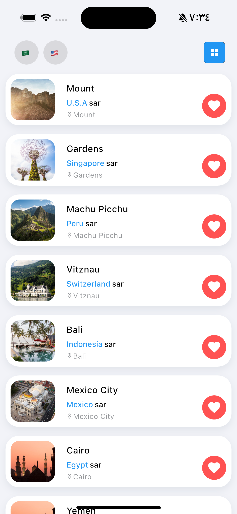

<!--
This README describes the package. If you publish this package to pub.dev,
this README's contents appear on the landing page for your package.

For information about how to write a good package README, see the guide for
[writing package pages](https://dart.dev/tools/pub/writing-package-pages).

For general information about developing packages, see the Dart guide for
[creating packages](https://dart.dev/guides/libraries/create-packages)
and the Flutter guide for
[developing packages and plugins](https://flutter.dev/to/develop-packages).
-->
# LocalHeroTransform

[](https://opensource.org/licenses/MIT)

## About LocalHeroTransform Package
LocalHeroTransform is a powerful Flutter package designed to simplify the creation of seamless transitions between items in grid and list views. By leveraging local hero animations, this package enhances the visual appeal of your app while providing a smooth user experience.

## Platform Support

| Android | iOS | MacOS  | Web | Linux | Windows |
| :-----: | :-: | :---:  | :-: | :---: | :-----: |
|   ✔️    | ✔️  |  ✔️   | ✔️  |  ✔️   |   ✔️  |

## ✨Features
- Easy Integration: Effortlessly integrate local hero animations in your Flutter applications with minimal setup.
- Dynamic Page Transitions: Create engaging transitions between items in both grid and list layouts, enhancing user interaction.
- Customizable Animation: Control the duration and design size of transitions to fit the overall style of your app.
- Nested Navigation: Utilize a nested Navigator to maintain the general navigation state of your app while providing fluid page switching.
- Responsive Design: Built with responsiveness in mind, ensuring your animations look great on all screen sizes.
## Images

|  |  |  |
|:--------------------------------------------:|:--------------------------------------------:|:--------------------------------------------:|
| **Title 1**                                  | **Title 2**                                  | **Title 3**                                  |


## Getting started

TODO: List prerequisites and provide or point to information on how to
start using the package.

## Usage

TODO: Include short and useful examples for package users. Add longer examples
to `/example` folder.

```dart
const like = 'sample';
```

## Additional information

TODO: Tell users more about the package: where to find more information, how to
contribute to the package, how to file issues, what response they can expect
from the package authors, and more.
